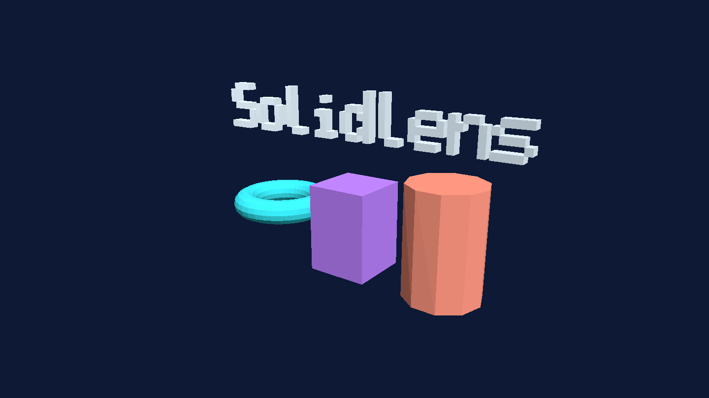
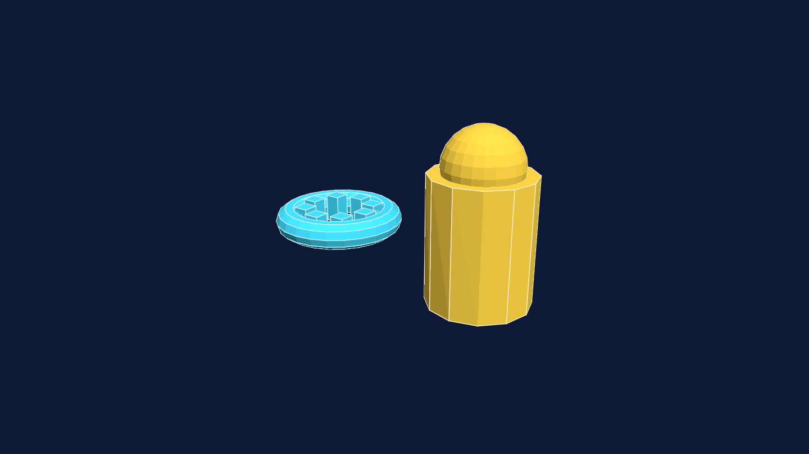
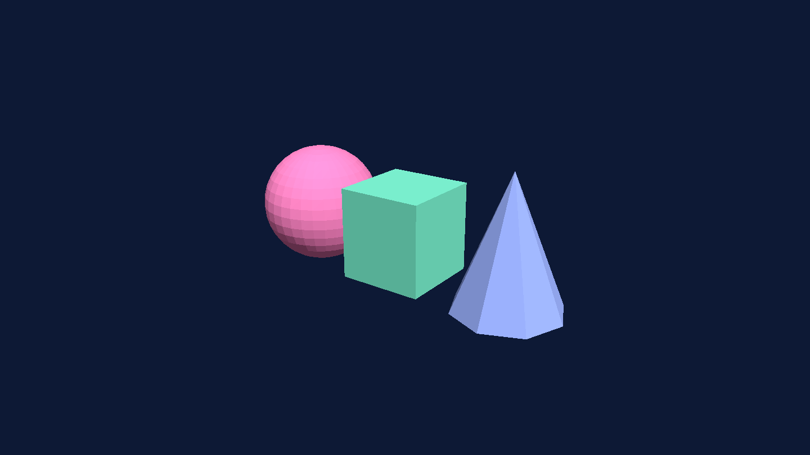

# solidlens

<p align="center">
  
</p>

`solidlens` is a pure-Go, headless raster renderer for triangle meshes. It
loads STL, 3MF, and OBJ files, accepts `*decad.Mesh` through `TriangleSource`,
and renders a configured scene to an `image.RGBA` or PNG stream.

The scene owns the camera, model materials, directional and point lights, and
background. The renderer owns only output dimensions, so it is safe to call
concurrently with independent scenes.

## Install

```text
go get github.com/lestrrat-3d/solidlens
```

## API

Use `ReadMesh` when the filename selects the import format, or call
`ReadSTL`, `Read3MF`, or `ReadOBJ` directly. `Read3MF` uses
`github.com/lestrrat-go/3mf`, including build transforms, components, and
model units. `ReadSTL` uses `github.com/lestrrat-go/stl`.

Use `MeshFrom` for native geometry. `*decad.Mesh` satisfies `TriangleSource`
without an adapter because it provides `Vertices() []r3.Vec` and
`Triangles() [][3]int`.

Build a `Scene` with `Camera`, `Model`, `Material`, `DirectionalLight`,
`PointLight`, and `Background`, then call `Render` or `RenderPNG`. Mesh
coordinates are treated as millimetres.

The [examples](examples) package contains a tested end-to-end render.

## Gallery

The gallery uses triangle meshes built in Go and rendered with `RenderPNG`.
It shows directional and point lighting, per-model materials, perspective
camera placement, and a configured background.

| Mechanical forms | Primitive forms |
|---|---|
|  |  |

The committed STL and 3MF files in [`docs/models`](docs/models) are the scene
sources. Run `go run ./internal/cmd/genimages` to regenerate the checked-in
images from those files. Run `go run ./internal/cmd/genimages --models` only
when intentionally rebuilding the model assets.
